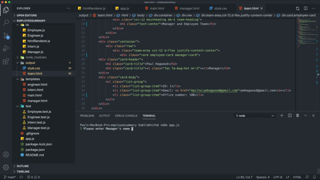

# Employee Org Chart Creator
## An application running in Node.js to help a manager create an org chart

This directory contains an application running in the terminal to create an org chart for a manager. Using this application, a manager can enter information about themself and about their employees and the application will produce a html file to save the manager's org chart. 

The application needs to be downloaded to the users computer and then run through the terminal. 

The files can be located here [portfolio](https://github.com/pmhagwood/employeesummary)
The video of the running application can be located here [youtube video](https://youtu.be/a5XxbizCfj8)

